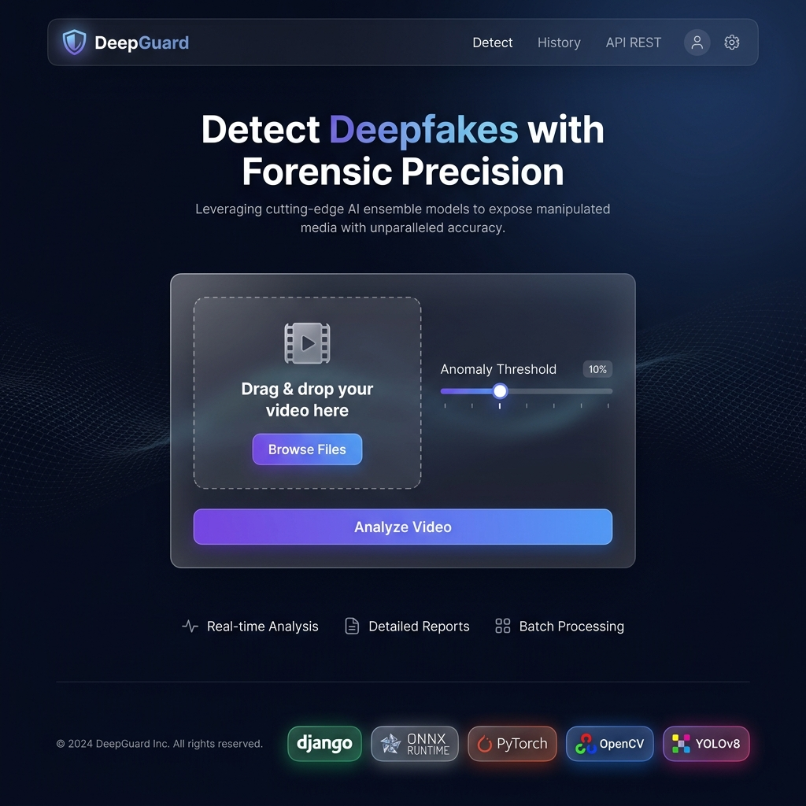
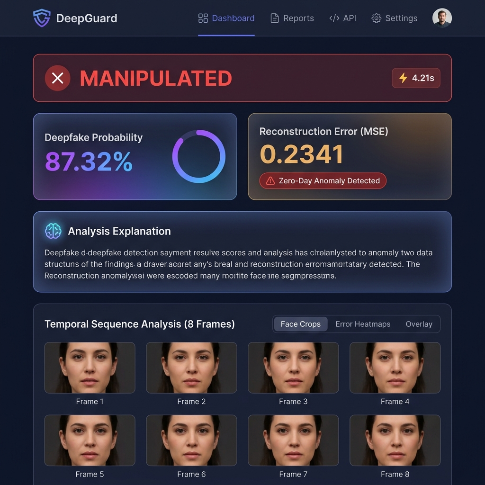
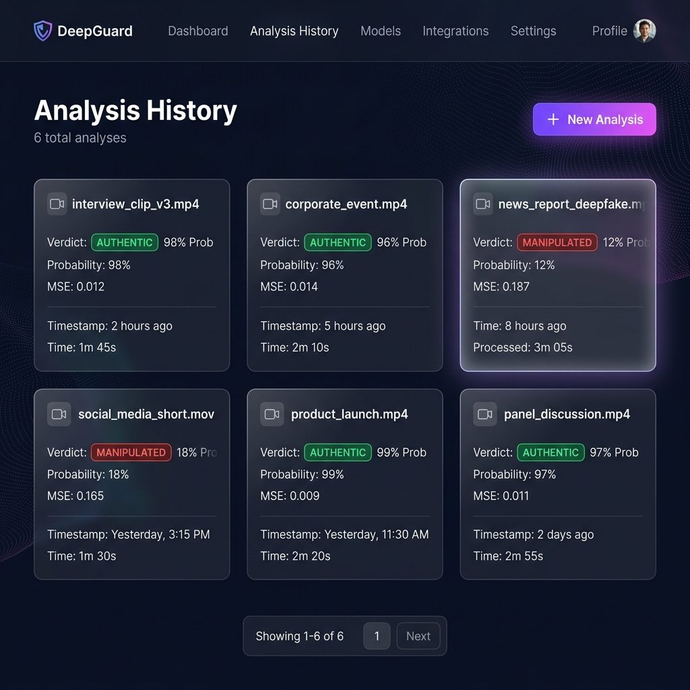
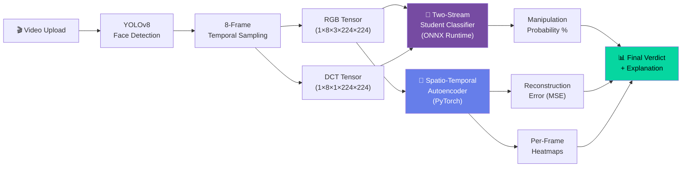
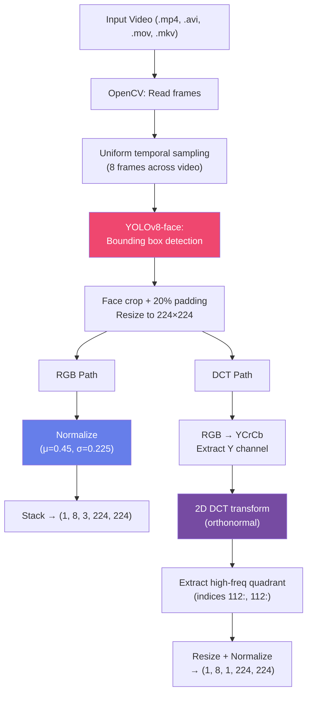
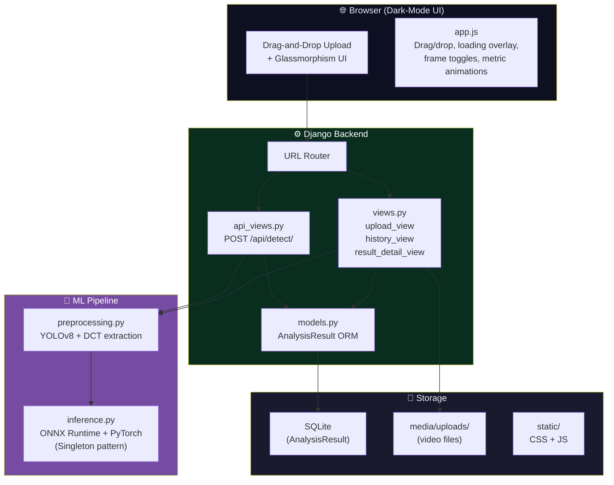

# 🛡️ DeepGuard — AI-Powered Deepfake Detection

A production-grade web application for real-time deepfake detection using a **two-stream spatio-temporal + frequency-aware ensemble** with forensic heatmap visualisation.


---

## Screenshots

### Upload & Detect


### Analysis Results


### Analysis History


---

## System Architecture

### High-Level Pipeline



### Detection Streams

The ensemble combines two complementary detection strategies:

| Stream | Model | Purpose | Strengths |
|---|---|---|---|
| **Stream 1: Student Classifier** | X3D backbone + FrequencyBranch (DCT) | Detect **known** manipulation artifacts | Trained on FaceForensics++; captures spatial-temporal inconsistencies + high-frequency GAN fingerprints |
| **Stream 2: Anomaly Detector** | Conv3D Autoencoder | Detect **unknown/zero-day** manipulations | Learns authentic facial manifold; flags unseen techniques via reconstruction error |

**Verdict logic:**
```
MANIPULATED if (student_probability > 50%) OR (reconstruction_error > threshold)
AUTHENTIC   otherwise
```

### Preprocessing Pipeline



### Web Application Architecture



---

## Model Benchmarks

### Student Classifier (Two-Stream X3D + DCT)

| Metric | Value |
|---|---|
| **Architecture** | X3D-S spatial backbone (2048-d) + Conv3D frequency branch (128-d) → FC classifier |
| **Input** | 8 face frames × 224×224, RGB + DCT channels |
| **Training data** | FaceForensics++ (c23 compression) |
| **Training** | 10 epochs, knowledge distillation from teacher ensemble |
| **Model size (ONNX)** | 407 MB |
| **Inference backend** | ONNX Runtime (CPU, 4 threads, graph-optimized) |

### Autoencoder (Anomaly Detector)

| Metric | Value |
|---|---|
| **Architecture** | Conv3D encoder (3→16→32→64) + ConvTranspose3D decoder (64→32→16→3) |
| **Input** | 8 frames × 224×224 × 3 channels, permuted to (1, 3, 8, 224, 224) |
| **Training** | 5 epochs on authentic-only faces |
| **Anomaly threshold** | Configurable MSE (default: 0.15) |
| **Model size** | 556 KB |
| **Inference backend** | PyTorch CPU |

### Face Detection

| Metric | Value |
|---|---|
| **Model** | YOLOv8n-face (Ultralytics) |
| **Model size** | 6 MB |
| **Crop strategy** | Largest face + 20% padding, 224×224 resize |

### Inference Performance (CPU)

| Stage | Approx. Time |
|---|---|
| Video decode + face detection | ~1–3s |
| DCT feature extraction (8 frames) | ~0.2s |
| ONNX student inference | ~1–2s |
| Autoencoder + heatmap generation | ~0.5s |
| **Total end-to-end** | **~3–6s per video** |

> *Benchmarked on CPU inference. GPU acceleration available via CUDA providers for ONNX Runtime and PyTorch.*

---

## Features

- 🎬 **Drag-and-drop video upload** with real-time validation (.mp4, .avi, .mov, .mkv up to 100 MB)
- 🔍 **Forensic heatmaps** showing per-frame manipulation regions (JET colourmap overlays)
- 🧠 **Confidence explanations** — not just scores, but *why* it flagged a video
- 📊 **Analysis history** with paginated, searchable results dashboard
- ⚡ **REST API** — `POST /api/detect/` for programmatic access
- 🌙 **Premium dark UI** with glassmorphism, micro-animations, and gradient mesh backgrounds
- 🔒 **Thread-safe singleton** model loading (loads once at startup, serves concurrent requests)

---

## Quick Start

### Prerequisites

| Requirement | Details |
|---|---|
| **Python** | 3.10 or higher |
| **Model weights** | Place in `../output/` directory (see below) |
| **Disk space** | ~1.5 GB for all model weights |

### 1. Clone the repository

```bash
git clone https://github.com/chaitanya2190/Deep-guard.git
cd Deep-guard
```

### 2. Create a virtual environment

```bash
python -m venv venv

# Windows
venv\Scripts\activate

# macOS/Linux
source venv/bin/activate
```

### 3. Install dependencies

```bash
cd deepguard_web
pip install -r requirements.txt
```

### 4. Set up model weights

Ensure your trained model weights are in the `output/` directory at the project root:

```
Deep-guard/
├── output/
│   ├── deepguard_student.onnx           # 407 MB — ONNX student classifier
│   ├── autoencoder_weights_v2/
│   │   └── autoencoder_v2_epoch_5.pth   # 556 KB — Autoencoder weights
│   └── student_weights_v2/              # (PyTorch checkpoints, not needed for web app)
├── yolov8n-face.pt                      # 6 MB — YOLOv8 face detector
└── deepguard_web/                       # ← Django project lives here
```

> **Note:** Model weights are excluded from Git via `.gitignore` due to their size. Train them using the included Jupyter notebooks, or contact the maintainer.

### 5. Run database migrations

```bash
python manage.py migrate
```

### 6. Start the development server

```bash
python manage.py runserver
```

Visit **http://localhost:8000** to upload videos and detect deepfakes.

---

## API Reference

### `POST /api/detect/`

Programmatic deepfake detection endpoint.

**Request:** `multipart/form-data`

| Field | Type | Required | Description |
|---|---|---|---|
| `video` | file | ✅ | Video file (.mp4, .avi, .mov, .mkv), max 100 MB |
| `threshold` | float | ❌ | Anomaly MSE threshold (0.01–0.50, default: 0.15) |

**Example:**
```bash
curl -X POST \
  -F "video=@suspect_video.mp4" \
  -F "threshold=0.15" \
  http://localhost:8000/api/detect/
```

**Response:** `200 OK`
```json
{
    "id": 1,
    "filename": "suspect_video.mp4",
    "deepfake_probability": 87.32,
    "reconstruction_error": 0.2341,
    "is_anomaly": true,
    "verdict": "MANIPULATED",
    "explanation": "The two-stream classifier detected manipulation artifacts with 87.32% confidence. Strong spatial-frequency inconsistencies suggest face-swap or reenactment techniques. ⚠ Zero-day anomaly: Reconstruction error (0.2341) exceeds threshold (0.15), indicating unnatural facial structure not seen in training.",
    "processing_time_seconds": 4.21,
    "created_at": "2026-07-25T15:00:00Z"
}
```

**Error Responses:**

| Code | Reason |
|---|---|
| `400` | No video file provided, or unsupported format, or file too large |
| `422` | Could not extract 8 face frames from the video |

---

## Project Structure

```
Deep-guard/
├── app.py                        # Standalone Streamlit inference app
├── deepfake.ipynb                # Training notebook (student classifier)
├── deepfake2.ipynb               # Training notebook (autoencoder)
├── requirements.txt              # Training dependencies
├── yolov8n-face.pt               # YOLOv8 face detection weights
│
└── deepguard_web/                # Django web application
    ├── manage.py                 # Django management CLI
    ├── requirements.txt          # Web app dependencies
    ├── Procfile                  # Gunicorn start command (Render/Heroku)
    ├── render.yaml               # Render Blueprint (one-click deploy)
    ├── .env.example              # Environment variable template
    │
    ├── detector/                 # Core detection Django app
    │   ├── preprocessing.py      # YOLOv8 face extraction + DCT features
    │   ├── inference.py          # ONNX + PyTorch inference engine (singleton)
    │   ├── views.py              # Upload, history, result detail views
    │   ├── api_views.py          # REST API endpoint (POST /api/detect/)
    │   ├── models.py             # AnalysisResult ORM model
    │   ├── forms.py              # VideoUploadForm with validation
    │   └── admin.py              # Django admin registration
    │
    ├── templates/                # Django HTML templates
    │   ├── base.html             # Base layout (nav, footer, meta)
    │   └── detector/
    │       ├── upload.html       # Upload page + inline results
    │       ├── result.html       # Dedicated result detail page
    │       └── history.html      # Paginated analysis history
    │
    ├── static/
    │   ├── css/style.css         # Full design system (1200+ lines)
    │   └── js/app.js             # Drag-drop, loading overlay, animations
    │
    ├── docs/screenshots/         # README demo images
    │
    └── deepguard_web/            # Django project config
        ├── settings.py           # Config with model path env vars
        ├── urls.py               # Root URL routing
        ├── wsgi.py               # WSGI entry point
        └── asgi.py               # ASGI entry point
```

---

## Tech Stack

| Layer | Technology | Purpose |
|---|---|---|
| **Backend** | Django 5.2, Python 3.10+ | Web framework, ORM, admin |
| **ML — Classifier** | ONNX Runtime 1.17 | Optimized CPU inference for X3D+DCT student model |
| **ML — Anomaly** | PyTorch 2.1 | Autoencoder forward pass + heatmap generation |
| **Face Detection** | YOLOv8n-face (Ultralytics) | Real-time bounding box detection |
| **Computer Vision** | OpenCV 4.10 | Video decode, image processing, colour maps |
| **Signal Processing** | SciPy (DCT) | Discrete Cosine Transform for frequency features |
| **Frontend** | Vanilla HTML/CSS/JS | Glassmorphism UI, drag-drop, micro-animations |
| **Typography** | Inter + JetBrains Mono (Google Fonts) | Premium, readable design |
| **Database** | SQLite (dev) | Analysis result persistence |
| **Static Files** | WhiteNoise | Production-ready static file serving |
| **Deployment** | Gunicorn, Render | WSGI server + cloud hosting |

---

## Deployment

### One-Click Deploy to Render

[](https://render.com/deploy?repo=https://github.com/chaitanya2190/Deep-guard)

This repo includes a [`render.yaml`](deepguard_web/render.yaml) blueprint — Render will auto-configure the service from it.

### Manual Deploy (Render Free Tier)
1. Connect your GitHub repo on [render.com](https://render.com)
2. Set environment variables from `.env.example`
3. **Build command:** `pip install -r requirements.txt && python manage.py collectstatic --noinput && python manage.py migrate`
4. **Start command:** `gunicorn deepguard_web.wsgi --bind 0.0.0.0:$PORT`

### Environment Variables

| Variable | Default | Description |
|---|---|---|
| `DJANGO_SECRET_KEY` | (insecure dev key) | Production secret key |
| `DJANGO_DEBUG` | `True` | Set to `False` in production |
| `DJANGO_ALLOWED_HOSTS` | `localhost,127.0.0.1` | Comma-separated allowed hosts |
| `DEEPGUARD_ONNX_MODEL_PATH` | `../output/deepguard_student.onnx` | Path to ONNX student model |
| `DEEPGUARD_AUTOENCODER_PATH` | `../output/autoencoder_weights_v2/autoencoder_v2_epoch_5.pth` | Path to autoencoder weights |
| `DEEPGUARD_FACE_DETECTOR_PATH` | `../yolov8n-face.pt` | Path to YOLOv8 face detector |

> **⚠️ Note:** The free tier has limited resources. Model weights (~400 MB ONNX) need to be available at the configured paths.

---

## License

This project is licensed under the [MIT License](LICENSE).

---

Built as part of the DeepGuard deepfake detection research project.
